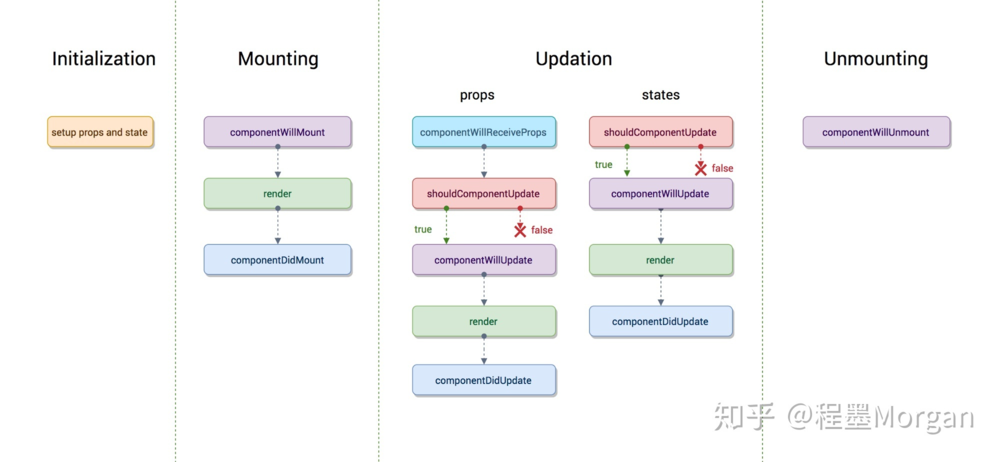

# 前端开发面试题汇总

****

1. 以哪个不是 react 组件的生命周期回调函数？(A)<br/>
   A. componentWillMount()<br/>
   B. componentDidCreat()<br/>
   C. componentDidUpdate()<br/>
   D. shouldComponentUpdate()<br/>
* 解析<br/>
  
1. 以下哪个不是 Vue 组件的生命周期回调函数 (D)<br/>
   A. created()<br/>
   B. mounted()<br/>
   C. changed()<br/>
   D.destroyed()<br/>
2. W3C 制定的 javascript 标准事件模型，以下正确顺序以及描述是？()

   A. 事件捕获 ->事件冒泡<br/>
   B. 事件捕获 ->事件处理 ->事件冒泡<br/>
   C. 事件冒泡 ->事件处理 ->事件捕获<br/>
   D. 事件处理 ->事件捕获 ->事件冒泡<br/>
3. 以下代码在浏览器中的运行结果是 ()

   ```
   var arr = [ 1,2,3 ]
   arr.shift();// ->[2,3]
   arr.push();//->[2,3]
   arr.unshift();
   console.log(arr.concat([1,2]));
   ```

   A. [2,2,3,1,1,2]<br/>
   B. [2,1,2,1,1,2]<br/>
   C. [2,2,3,1,[1,2]]<br/>
   D. [2,1,2,1,[1,2]]<br/>
4. 移动端的屏幕尺寸繁多，常用的自适应方案都有哪些？

5. 请写出 jQuery 绑定事件的方法，不少于两种
6. 对 string 对象进行扩展，使其具有删除前后空格的方法。
7. 某系列产品型号以 4 位数字开头，结尾可能带有一个大写字母，写出正则表达式和依据返回布尔值的 javascript 字符串验证代码。
8. 请指出以下代码的性能问题，并进行优化。

    ```
    var info="产品型号:XXX";
     info +="产品名称:XXX,";
     info +="产品参数:XXXXXXXXXXXXX,";
     info +="产品描述:XXXXXXXXXXXXX,";
    for(var i = 0 ; i < info.length; i++){
        alert(info[i]);
    }
    ```

9.  请简述 js 中 == 和 === 的区别
10. img 的 alt 和 title 的异同。
    * 相同点：当其发生作用时，都是通过一个浮层来显示相关的提示文字
    * 不同点：
      * alt: 倘若图片加载不成功未能显示出来，就会在图片未显示的地方出现一段文字。这一作用是为了给未加载出来的图片提供信息，方便用户浏览网页，同时也方便开发人员维护网页。
      * 搜索引擎可以通过这个属性的文字描述获取图片
    * title:title 属性可以用在任何元素上，当用户把鼠标移动到元素上时，就会出现 title 的内容，起到对图片说明的作用，其实质就是对图片的一种备注或者注释。
    * **通俗点讲**:alt 属性的实质是通过文字来代替图片的内容，而 title 属性的实质是对图片的描述或者注释。

11. rem,em,px 的区别
    * **px**: 相对长度单位。像素 px 是相对于显示屏幕分辨率而言的。
    * **em**:　em 是相对长度单位。相对于当前对象内文本的字体尺寸。如当前对行内文本的字体尺寸未被人为设置，则相对于浏览器的默认字体尺寸（16px）。
    * **rem**: rem 是 CSS3 新增的一个相对单位（root em 根 em），这个单位引起了广泛的关注。这个单位与 em 有什么区别呢？区别在于使用 rem 为元素设定字体大小时，仍然是相对大小，但相对的只是 HTML 根元素。这个单位可谓集相对大小和绝对大小的有点于一身，通过它既可以做到只修改根元素就成比例地调整所有字体大小，又可以避免字体大小逐层复合的连锁反应。

12. 根据如下函数，得出最后打印的数据并写出解题思路：

```
    var num = 0 ;
    function test(){
        var num = 5;
        return function(){
            num++;
            console.log(num);
        }
    }

    var val = test();
    val();//6
    val();//7
```

 * 解题思路
   * 外部函数调用之后其变量对象本应该被销毁，但闭包的存在使我们仍然可以访问外部函数的变量对象，这就是闭包的重要概念。
   * **内部未执行完，外部不会销毁。**
14. 动态计算出一个字符串 strings 中出现最多的字符。
15. 写一个方法，用于动态字符串数组 arrays 去重。
16. 简单写一个 Promise 的方法.
```
    var p = new Promise(function(resolve){
    setTimeout(resolve, 3000);

    });
    p.then(()=>console.log('show'))
```
17. 已知一个数组的规则a[n]=a[n-1]+a[n-2](n>=2),a[0]=1,a[1]=1,求下标为index的数组.
18. vue 中，如何创建一个控件，注入到父组件的步骤，并简单写一个父子组件数据传递的方法。
19. 简单写一个 vue2.0 的 axios post json 请求方法，并说明 axios 中各参数的含义。
20. 简述你知道的前端页面性能优化的方法。
21. 简述自己用过的前端技术框架以及使用周期。
