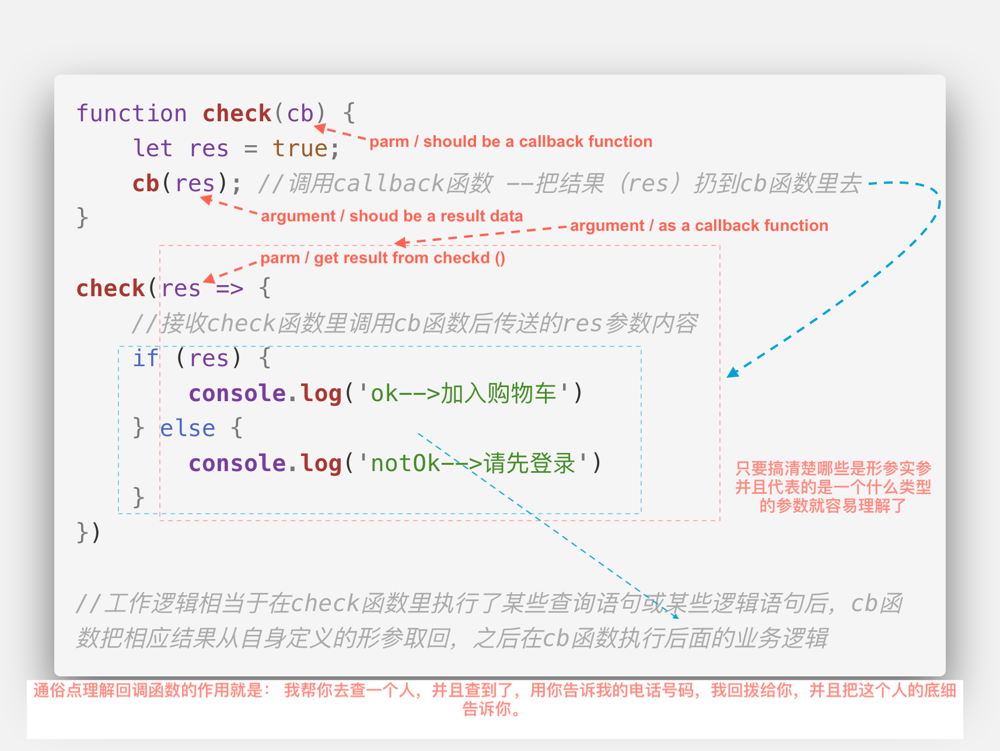

# 回调的理解与使用
****

```js
        function check(cb) {
            let res = true;
            cb(res); //调用callback函数 --把结果（res）扔到cb函数里去
        }

        check(res => {
            //接收check函数里调用cb函数后传送的res参数内容
            if (res) {
                console.log('ok-->加入购物车')
            } else {
                console.log('notOk-->请先登录')
            }
        })

        //工作逻辑相当于在check函数里执行了某些查询语句或某些逻辑语句后，cb函数把相应结果从自身定义的形参取回，之后在cb函数执行后面的业务逻辑
```

